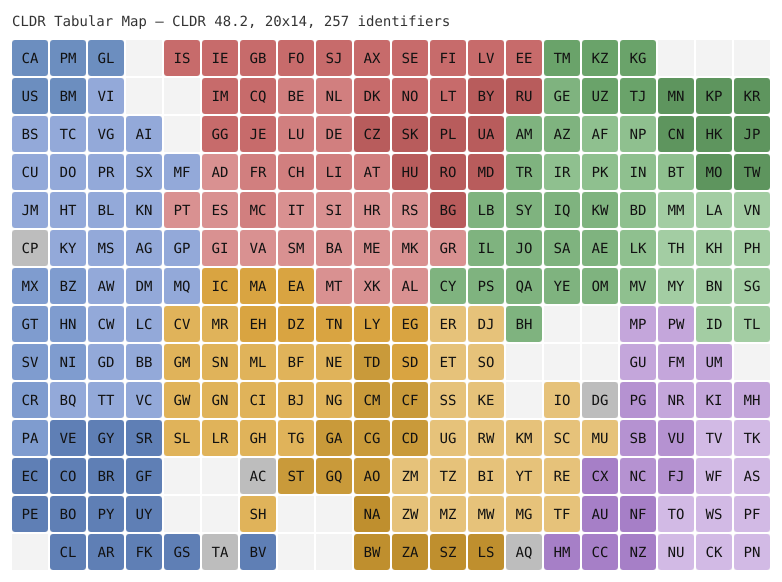

# CLDR Tabular Map

**One identifier, one equal cell.**

A geographically optimized tabular map of the regular Unicode CLDR region
identifiers. Every identifier in the pinned **CLDR 48.2** `regular` set
(257 two-letter identifiers) occupies exactly one square cell of a
**20 × 14** grid; the remaining 23 cells are intentional
whitespace. The arrangement is the best found under a documented objective
function, not a claim of geographic truth or a global optimum.



Successor to [`tabularmaps/8bit`](https://github.com/tabularmaps/8bit),
which arranged the 249 ISO 3166-1 alpha-2 codes plus `XK` on a 16 × 16
board in 2019. The mother set changed (CLDR now has 257 regular
identifiers), so the board changed with it; see [Why not 256](#why-not-256).

## Use the data

```text
board.csv        matrix view, 14 rows × 20 columns, lowercase identifiers, blank = empty field
metadata.json    profile, CLDR version, grid, counts, checksums, score summary
layouts/cldr-48.2-regular-2alpha-20x14.json   source of truth: long-form placements + structural spaces + derived board
data/regions.json    the mother set with English names and CLDR/M49 subregions
```

`board.csv` follows the `tabularmaps/8bit` convention (header row of column
indices, then one row per board row) so existing consumers such as
`d3.csv('board.csv')` keep working; note that it is 20 wide and 14
high, not 16 × 16.

The layout JSON is the primary contract:

```json
{
  "profile": "cldr-48.2-regular-2alpha",
  "cldr_version": "48.2",
  "grid": [20, 14],
  "placements": [{"id": "JP", "x": 19, "y": 2, "w": 1, "h": 1}, ...],
  "structural_spaces": [[3, 0], ...],
  "board": [["CA", "PM", "GL", "", ...], ...],
  "generator": {"script": "...", "seed": 1, "score": {...}}
}
```

`x` is the column from the left, `y` the row from the top. Every cell is
either exactly one placement or exactly one structural space, so an
intentionally blank cell, a missing value, an unrecognized identifier, and
an omitted mother-set member are four distinguishable errors
(`scripts/validate_board.py` names each). The same keys (`placements`,
`board`, `structural_spaces`, `generator`) are used by the sibling project
[`tabularmaps/do`](https://github.com/tabularmaps/do).

## What the map is and is not

- The mother set is the pinned **CLDR 48.2** `common/validity/region.xml`
  `idStatus="regular"` class, restricted to two-letter identifiers:
  257 identifiers, checksummed and extracted by script. ISO 3166-1
  is cited for comparison only (249 ISO codes + `AC CP CQ DG EA IC TA XK`).
- Every identifier receives one equal cell. Cell size **does not represent**
  physical area, population, GDP, importance, recognition or status.
- A region identifier is **not the same thing as a sovereign state**.
  Inclusion expresses no recognition or endorsement; the layout **does not settle** territorial claims, borders, or names. Where an input dataset
  had to take a position (which polygons touch, which unit a contested
  area counts for), the source and rule are exposed in
  [SOURCES.md](SOURCES.md) and [DECISIONS.md](DECISIONS.md) instead of
  being presented as this project's judgement.
- Geographic proximity on the board is **approximate**. Land-border
  neighbours are usually adjacent; sea neighbours are usually near; no grid
  can preserve every relationship.
- Blank cells are **intentional** cartographic whitespace, listed
  explicitly as `structural_spaces`. There is no overflow row or column.
- The 20 × 14 grid is an evaluated design choice, not a natural fact.
  Seven grids were optimized under identical budgets and compared
  ([OPTIMIZATION.md](OPTIMIZATION.md)).
- The arrangement is the best layout found under the documented objective,
  weights, inputs, seeds and search budget. It is **not necessarily a global optimum** and it is expected to be criticized and improved.

## Dashboard (Open MCT)

`docs/` is a small [Open MCT](https://github.com/nasa/openmct) dashboard,
the same construction as the sibling project `tabularmaps/do`: a
dependency-free SVG rendering core (`docs/tabularmap.js`), an Open MCT
plugin that only uses the object, composition and view providers
(`docs/openmct-plugin.js`), and demo indicators (`docs/demo-sources.js`).

- Published: <https://tabularmaps.github.io/cldr/> (rendering core alone:
  <https://tabularmaps.github.io/cldr/preview.html>)
- Locally: `python3 -m http.server 8765 --directory docs`, then open
  <http://localhost:8765/>. Expand "CLDR tabular map" in the tree and pick an
  indicator; its values colour the cells.

To connect your own data, define an indicator as in `docs/demo-sources.js`
and pass it to the plugin:

```js
openmct.install(TabularMapsCldrPlugin({
  dataUrl: './data/',
  sources: [{
    key: 'my-indicator', name: 'My indicator', refreshMs: 60000,
    fetchValues: async () => ({ label: 'Value', unit: '%', min: 0, max: 100, values: { JP: 12.3, FR: 45.6 } })
  }]
}));
```

Values are keyed by identifier; cells without a value show the "no data"
colour, and subregion colours are only the default when no indicator is
selected. The "UN members only" button mutes the identifiers outside the
`UN` grouping of CLDR's `territoryContainment` (193 members) without moving
any cell; it is off by default and restates CLDR data, not a view of this
project (DECISIONS.md D15).

## Why not 256

`8bit` fitted 250 identifiers into 256 cells. CLDR 48.2 has 257 regular
identifiers. Removing one to keep a 16 × 16 board would replace a
reproducible upstream definition with a project judgement about which
territory is dispensable, and the next CLDR addition would recreate the
problem. The board adapts to the mother set; the mother set is never
trimmed to the board. Full reasoning: [DECISIONS.md D3](DECISIONS.md).

## How the layout was made

1. **Mother set** — extracted from the pinned CLDR archive
   (`scripts/extract_cldr_regions.py`).
2. **Geographic inputs** — one representative point per identifier
   (Wikidata, CC0), land adjacency derived from Natural Earth 10m map units
   (public domain), and CLDR's own M49-based subregions
   (`scripts/build_geographic_inputs.py`; details in SOURCES.md).
3. **Objective** — seven scored components: nearest-neighbour preservation,
   global distance correlation, land-border adjacency, east–west /
   north–south order, subregion cohesion, false adjacency, and enclosed
   blank holes; plus a reported (weight 0) legacy-displacement term
   against `8bit` (`cldrmap/scoring.py`).
4. **Search** — simulated annealing from a geographic projection, several
   seeds per grid, identical budgets across the seven candidate grids
   (`scripts/compare_grids.py`, `scripts/optimize_layout.py`).
5. **Review** — human cartographic review of the best boards; any manual
   pin is recorded with its reason and before/after scores in DECISIONS.md.

## Verify and reproduce

Fast path (what CI runs; no network):

```bash
uv run scripts/extract_cldr_regions.py --check
uv run scripts/validate_board.py
uv run pytest -q
```

Score any board, including your own:

```bash
uv run scripts/score_layout.py board.csv
uv run scripts/score_layout.py data/legacy/8bit-board.csv --partial
```

Full regeneration (downloads Natural Earth once, then minutes of CPU):
see [OPTIMIZATION.md § Reproducing the result](OPTIMIZATION.md#reproducing-the-result).

## Updating to a newer CLDR release

A newer CLDR release must not silently change the board. Updating is an
explicit maintenance event:

1. download the new `cldr-common-<ver>.zip`, verify it against Unicode's
   published hashes, copy `common/validity/region.xml` and `LICENSE` to
   `data/cldr/<ver>/`, and update `data/profile.json` (version, tag,
   commit, URLs, checksums, extraction date, expected count);
2. run `scripts/extract_cldr_regions.py --cldr-dir …` and diff
   `data/regions.json`; classify additions, removals, and deprecations;
3. rebuild geographic inputs (new identifiers need points, adjacency, and
   possibly supplements with sources);
4. decide between stable insertion into existing whitespace and
   re-optimization; run the grid comparison if the count changed enough to
   question the grid;
5. regenerate `layouts/`, `board.csv`, `metadata.json`, `docs/`, the
   reports, and the CHANGELOG; add a DECISIONS.md entry;
6. open a pull request. Until step 1 is done, the tests fail with an
   "explicit maintenance event" message if `region.xml` changes.

## Repository map

```text
board.csv, metadata.json     derived artifacts of the selected layout
layouts/                     selected layout JSON (+ candidates/ from the grid comparison)
data/cldr/48.2/              pinned CLDR input + license
data/profile.json            pinned profile
data/regions.json            mother-set manifest (generated)
data/geo/                    points, adjacency, supplements, raw Wikidata snapshot
data/legacy/                 tabularmaps/8bit board + license
cldrmap/                     library: mother_set, geo, board, scoring, optimize, baselines, render
scripts/                     CLIs (extract, build inputs, score, optimize, compare grids, validate, render)
tests/                       pytest suite
reports/                     grid comparison and sensitivity reports
design/                      optional human constraints (territory maps, pins)
docs/                        GitHub Pages: Open MCT dashboard, preview.html, board.svg, data/ copies
OPTIMIZATION.md              objective, weights, search, comparison, review
SOURCES.md, NOTICE.md        inputs and attributions
DECISIONS.md                 append-only decision log
CHANGELOG.md                 release notes
CLAUDE.md                    instructions for coding agents + the project mandate
```

## License

Everything created in this repository is released under
[CC0 1.0](LICENSE). Third-party inputs keep their own terms
([NOTICE.md](NOTICE.md)): Unicode CLDR (Unicode-3.0), Natural Earth
(public domain), Wikidata (CC0), tabularmaps/8bit (Unlicense).
